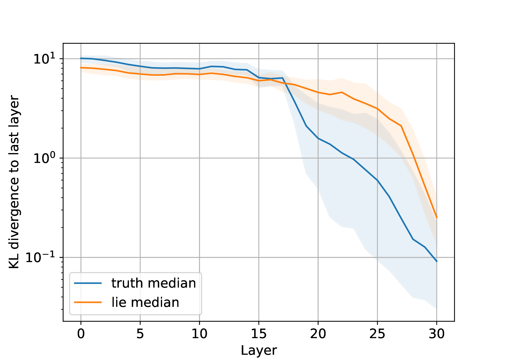

# An information-theoretic study of lying in LLMs

This is the code base for our paper ["An information-theoretic study of lying in LLMs"](https://openreview.net/forum?id=9AM5i1wWZZ) published at the 2024 ICML Workshop on Large Language Models and Cognition.  


## Install
Tested on Python 3.10.12

```
git clone https://github.com/annahdo/info_theoretic_study_lying.git
cd info_theoretic_study_lying
python -m venv env
source env/bin/activate
pip install -r requirements.txt
```
## Run
Check out the [demo notebook](demo.ipynb) to get a feeling for our pipeline or run the [shell script](run_all_experiments.sh) to run all the experiments from the paper. 

## Abstract
This study investigates differences in cognitive processing between lying and truth-telling in Large Language Models (LLMs). Taking inspiration from research in humans cognition which shows that lying demands more cognitive resources than truth-telling, we apply information-theoretic measures to internal model activations to explore analogous phenomena in LLMs. Our analysis reveals that LLMs converge more quickly to the output distribution when telling the truth and exhibit higher entropy when constructing lies. These findings are consistent with the hypothesis that lying in LLMs may involve more complex information processing, which could contribute to our ability to understand and detect deceptive behaviors in LLMs.

## Method
We briefly summarize our experimental process below.

**Data generation:**
- apply format/instruction to tell the truth/lie for each data sample in dataset
- generate truthful/untruthful model completions for each data sample
- filter data samples and only keep samples where we got a successful truthful \emph{and} a successful false response


The following example is meant to illustrate the setup:


**Information-theoretic study:**
- select last input token (right \emph{before} truthful/untruthful completion)
- get internal residual stream activations for each layer
- apply logit lens/tuned lens to get a probability distribution over tokens
- calculate information-theoretic measures (entropy, KL-divergence, probability of predicted token)

## Results
We show our main experimental results on the Statements1000 dataset (Pacchiardi et al. 2023) using the zephyr-7b-beta model.
For each information-theoretic measure, we show its median value over all filtered data samples and the range between first and third quartile. We plot the quantities over layer indices ranging from $0$ to $L-1$.

<div style="display: flex; justify-content: space-between;">
  
  
  
</div>

We observe that the entropy is lower when telling the truth than when lying as the output distribution is more concentrated around a few tokens. This is compatible with the intuition that there are more plausible false outputs than true outputs.
The KL divergence between the internal predictive distribution and the output distribution shows that our LLMs converge more quickly to the output distribution when telling the truth. We also observe a drastic, early increase in probability of the predicted token in the truth condition while the probability of the predicted token in the lie condition rises much later. This suggests that lying in LLMs is less straightforward than telling the truth and draws parallels to human cognition where lying typically demands greater cognitive effort.

Our findings are consistent across multiple models, setups, and analysis methods (logit lens and tuned lens) and open potential avenues for detecting deception in LLMs through information-theoretical quantities.

## Citation

If you found this code useful, please consider citing our paper.

```
@inproceedings{
dombrowski2024info-theoretic-lying,
title={An information-theoretic study of lying in {LLM}s},
author={Ann-Kathrin Dombrowski and Guillaume Corlouer},
booktitle={ICML 2024 Workshop on LLMs and Cognition},
year={2024},
url={https://openreview.net/forum?id=9AM5i1wWZZ}
}
```
